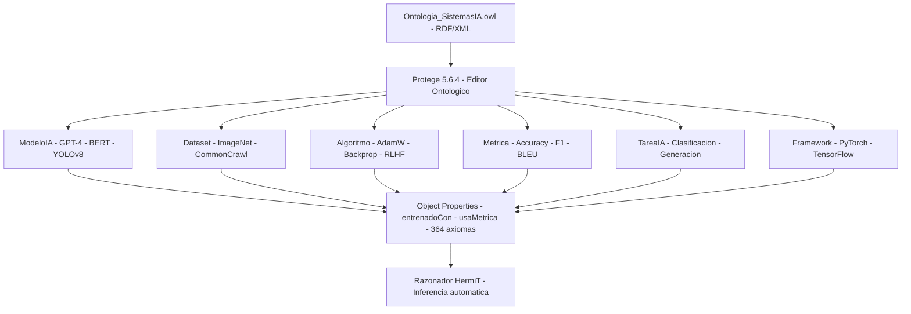

<div align="center">

# 🧠 Ontología de Sistemas de Inteligencia Artificial

[](https://www.w3.org/TR/owl2-overview/)
[](https://protege.stanford.edu/)
[](https://www.w3.org/TR/rdf-syntax-grammar/)
[](https://www.unir.net/)

<br/>

**Laboratorio No. 2 — Diseño e Implementación de una Ontología en Protégé**  
*Sistemas Inteligentes · Ingeniería Informática*

<br/>

> Una ontología formal que representa el ecosistema de la Inteligencia Artificial moderna:  
> modelos, datasets, algoritmos, métricas, tareas y frameworks — todos interconectados semánticamente.

</div>

---

## 📋 Tabla de Contenidos

- [Descripción General](#-descripción-general)
- [Estadísticas de la Ontología](#-estadísticas-de-la-ontología)
- [Arquitectura de la Ontología](#-arquitectura-de-la-ontología)
  - [Jerarquía de Clases](#-jerarquía-de-clases)
  - [Object Properties](#-object-properties)
  - [Data Properties](#-data-properties)
  - [Individuos Destacados](#-individuos-destacados)
- [Visualización del Grafo](#-visualización-del-grafo)
- [Estructura del Repositorio](#-estructura-del-repositorio)
- [Cómo Abrir en Protégé](#-cómo-abrir-en-protégé)
- [Tecnologías Utilizadas](#-tecnologías-utilizadas)
- [Autor](#-autor)

---

## Arquitectura



## 🎯 Descripción General

Esta ontología modela formalmente el **ecosistema de la Inteligencia Artificial moderna** usando el estándar **OWL 2** (Web Ontology Language). Permite representar, consultar y razonar sobre los componentes clave de un sistema de IA y las relaciones semánticas entre ellos.

El dominio captura entidades reales como **GPT-4**, **BERT**, **YOLOv8**, **Stable Diffusion**, **PyTorch**, **TensorFlow** y los datasets, algoritmos y métricas asociados a cada uno — estructurados en una jerarquía ontológica coherente con **364 axiomas**.

**¿Por qué importa?**  
Las ontologías permiten que las máquinas *entiendan* el significado de los datos, no solo su estructura. En IA, esto habilita búsqueda semántica, razonamiento automático e integración de conocimiento entre sistemas heterogéneos.

---

## 📊 Estadísticas de la Ontología

| Componente | Cantidad |
|:-----------|:--------:|
| 🏛️ Clases totales | **22** |
| 📂 Clases principales | **6** |
| 🌿 Subclases | **16** |
| 🔗 Object Properties | **7** |
| 📝 Data Properties | **15** |
| 👤 Individuos / Instancias | **31** |
| ⚙️ Axiomas totales | **364** |

---

## 🏗️ Arquitectura de la Ontología

### 🌲 Jerarquía de Clases

```
owl:Thing
│
├── 🤖 ModeloIA
│   ├── ModeloAprendizajeProfundo
│   │   ├── ModeloLenguaje         → GPT-4, BERT
│   │   ├── ModeloVision           → ResNet-50, YOLOv8
│   │   └── ModeloGenerativo       → Stable Diffusion
│   └── ModeloAprendizajeAutomatico → Random Forest
│
├── 🗃️ Dataset
│   ├── DatasetTexto               → Common Crawl, Wikipedia Corpus
│   ├── DatasetImagen              → ImageNet, MS COCO, LAION-5B
│   └── DatasetTabular             → Dataset Tabular Genérico
│
├── ⚙️ Algoritmo
│   ├── AlgoritmoSupervisado       → Backpropagation, Decision Tree
│   ├── AlgoritmoNoSupervisado     → K-Means
│   ├── AlgoritmoRefuerzo          → RLHF
│   └── AlgoritmoOptimizacion      → AdamW, SGD
│
├── 📏 Metrica
│   ├── MetricaClasificacion       → Accuracy, F1-Score, mAP, Top-K
│   ├── MetricaRegresion           → RMSE
│   └── MetricaGeneracion          → BLEU Score, FID
│
├── 🎯 TareaIA
│   ├── Clasificacion
│   ├── Regresion
│   ├── DeteccionObjetos
│   ├── GeneracionTexto
│   └── Clustering
│
└── 🛠️ Framework
    → PyTorch, TensorFlow/Keras, Scikit-Learn
```

---

### 🔗 Object Properties

Relaciones semánticas entre clases con dominio y rango estrictamente definidos:

| Propiedad | Dominio | Rango | Significado |
|:----------|:--------|:------|:------------|
| `entrenaCon` | ModeloIA | Dataset | Un modelo se entrena con un dataset |
| `usaAlgoritmo` | ModeloIA | Algoritmo | Un modelo utiliza un algoritmo de aprendizaje |
| `evaluadoCon` | ModeloIA | Metrica | Un modelo es evaluado con una métrica |
| `resuelve` | ModeloIA | TareaIA | Un modelo resuelve un tipo de tarea de IA |
| `implementadoCon` | ModeloIA | Framework | Un modelo se implementa con un framework |
| `requiereDataset` | Algoritmo | Dataset | Un algoritmo requiere un dataset |
| `aplicaMetrica` | TareaIA | Metrica | Una tarea aplica una métrica de evaluación |

---

### 📝 Data Properties

Atributos literales con tipos de dato `xsd` estrictamente tipados:

<details>
<summary><b>ModeloIA (5 propiedades)</b></summary>

| Propiedad | Tipo | Descripción |
|:----------|:-----|:------------|
| `nombreModelo` | `xsd:string` | Nombre del modelo |
| `anioPublicacion` | `xsd:integer` | Año de publicación |
| `numeroParametros` | `xsd:long` | Número de parámetros entrenables |
| `tipoAprendizaje` | `xsd:string` | Tipo de aprendizaje (supervisado, etc.) |
| `arquitectura` | `xsd:string` | Arquitectura del modelo |

</details>

<details>
<summary><b>Dataset (4 propiedades)</b></summary>

| Propiedad | Tipo | Descripción |
|:----------|:-----|:------------|
| `nombreDataset` | `xsd:string` | Nombre del dataset |
| `cantidadMuestras` | `xsd:integer` | Número de muestras |
| `etiquetado` | `xsd:boolean` | ¿Está etiquetado? |
| `dominio` | `xsd:string` | Dominio de aplicación |

</details>

<details>
<summary><b>Algoritmo, Metrica y Framework (6 propiedades)</b></summary>

| Propiedad | Tipo | Clase |
|:----------|:-----|:------|
| `nombreAlgoritmo` | `xsd:string` | Algoritmo |
| `tasaAprendizaje` | `xsd:float` | AlgoritmoOptimizacion |
| `nombreMetrica` | `xsd:string` | Metrica |
| `valorOptimo` | `xsd:string` | Metrica |
| `nombreFramework` | `xsd:string` | Framework |
| `lenguajeProgramacion` | `xsd:string` | Framework |

</details>

---

### 👤 Individuos Destacados

Instancias reales del estado del arte en IA, con sus relaciones semánticas completas:

| Individuo | Clase | Parámetros | Año | Framework |
|:----------|:------|:----------:|:---:|:----------|
| **GPT-4** | ModeloLenguaje | ~1T | 2023 | PyTorch |
| **BERT** | ModeloLenguaje | 340M | 2018 | TensorFlow |
| **YOLOv8** | ModeloVision | 11M | 2023 | PyTorch |
| **ResNet-50** | ModeloVision | 25M | 2015 | PyTorch |
| **Stable Diffusion** | ModeloGenerativo | — | 2022 | PyTorch |
| **Random Forest** | ModeloAprendizajeAutomatico | — | — | Scikit-Learn |

<details>
<summary><b>Ver todos los 31 individuos</b></summary>

**Modelos (6):** GPT-4, BERT, YOLOv8, ResNet-50, Stable Diffusion, Random Forest  
**Datasets (6):** ImageNet, MS COCO, Common Crawl, Wikipedia Corpus, LAION-5B, Dataset Tabular Genérico  
**Algoritmos (6):** AdamW, SGD, Backpropagation, K-Means, Decision Tree (CART), RLHF  
**Métricas (7):** Accuracy, F1-Score, mAP, Top-K Accuracy, BLEU Score, RMSE, FID  
**Tareas (3):** Tarea Clasificación, Tarea Detección Objetos, Tarea Generación Texto  
**Frameworks (3):** PyTorch, TensorFlow/Keras, Scikit-Learn  

</details>

---

## 🗺️ Visualización del Grafo

El siguiente grafo representa la estructura completa de la ontología: clases, subclases, individuos y sus relaciones semánticas.


> El archivo fuente del grafo en formato Graphviz está disponible en [`grafo_ontologia_HD.dot`](grafo_ontologia_HD.dot) para edición o renderizado personalizado.

---

## 📁 Estructura del Repositorio

```
Laboratorio2_Ontologia_SistemasIA/
│
├── 📄 SistemasIA.owl                              # Ontología OWL 2 (entregable principal)
├── 📑 Desarrollo Proyecto Alejandro De Mendoza.pdf # Reporte completo con capturas
├── 📝 Desarrollo Proyecto Alejandro De Mendoza.docx # Reporte en formato editable
├── 🗺️  grafo_ontologia_HD.png                     # Visualización del grafo (alta resolución)
├── 🔧 grafo_ontologia_HD.dot                      # Fuente del grafo en Graphviz
└── 📋 README.md                                   # Este archivo
```

---

## 🚀 Cómo Abrir en Protégé

1. **Descargar Protégé 5.6.4** desde [protege.stanford.edu](https://protege.stanford.edu/)
2. **Clonar este repositorio:**
   ```bash
   git clone https://github.com/AlejoTechEngineer/Laboratorio2_Ontologia_SistemasIA.git
   ```
3. **Abrir el archivo OWL en Protégé:**
   - `File` → `Open` → seleccionar `SistemasIA.owl`
4. **Explorar la ontología:**
   - Pestaña **Classes** → jerarquía de 22 clases
   - Pestaña **Object Properties** → 7 relaciones semánticas
   - Pestaña **Data Properties** → 15 atributos con tipos xsd
   - Pestaña **Individuals** → 31 instancias reales

> **Configuración recomendada:** Asignar al menos 4 GB de heap memory a Protégé para una carga fluida (`-Xmx4g` en el archivo de configuración).

---

## 🛠️ Tecnologías Utilizadas

| Tecnología | Uso |
|:-----------|:----|
| [OWL 2](https://www.w3.org/TR/owl2-overview/) | Lenguaje estándar para ontologías web |
| [Protégé 5.6.4](https://protege.stanford.edu/) | Editor visual de ontologías (Stanford) |
| [RDF/XML](https://www.w3.org/TR/rdf-syntax-grammar/) | Formato de serialización del archivo OWL |
| [Graphviz](https://graphviz.org/) | Generación del grafo de visualización |

---

## 👤 Autor

<div align="center">

**Alejandro De Mendoza**  
Ingeniería Informática - 
*Fundación Universitaria Internacional de La Rioja (UNIR)*

[](https://github.com/AlejoTechEngineer)
[](mailto:alejandro.mendoza.techengineer@gmail.com)

</div>

---

<div align="center">

*Laboratorio No. 2 · Sistemas Inteligentes · 2026*  
*Instructor: Ing. Juan Carlos Reyes Figueroa*

</div>